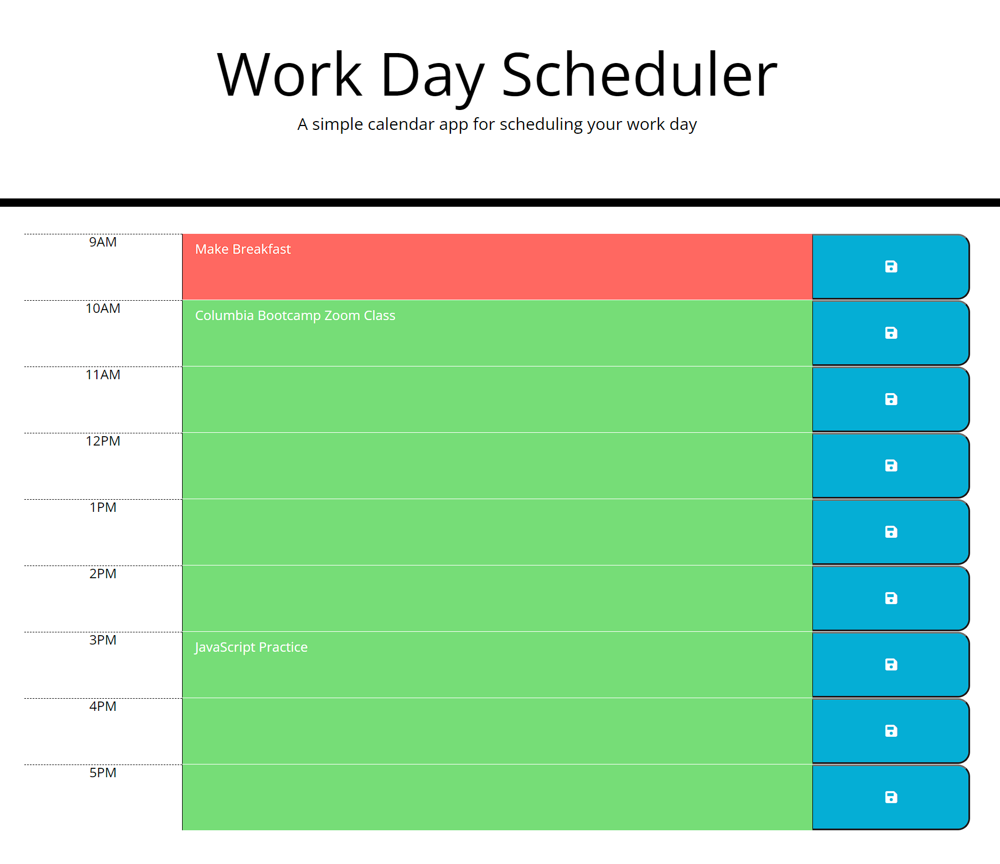
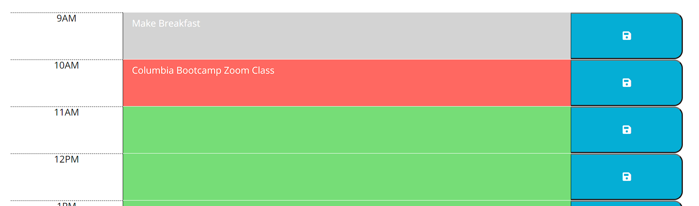

# JQuery: Work Day Scheduler

## Description

Keeping track of all the tasks you want to work on throughout the work day can present a challenge for anyone. This program is designed to provide a place for users to log their tasks for a given work day, so they can properly divide their time between the tasks.

## Usage
* go to https://jeffgrasso42.github.io/work-day-scheduler/
* Enter a task or an event into the center row of the corresponding hour
* Click the row's save button to log your task/event
*

## Tests
* textareas for past hours are displayed with a grey background, current hour textarea has a red background, and future hour textareas are displayed with a green background 

* Information saved by the user is preserved when the browser is reloaded
* 